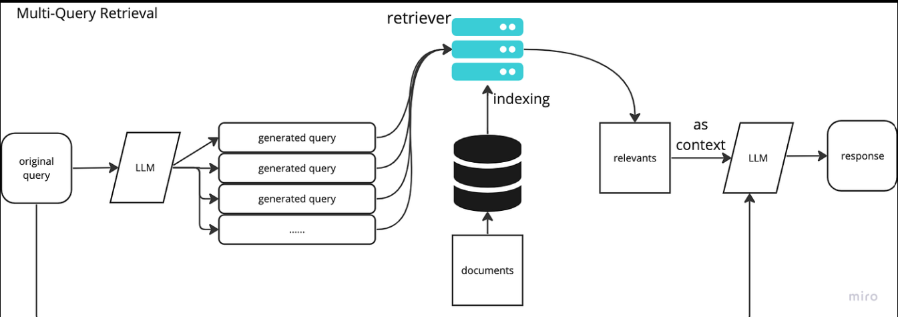
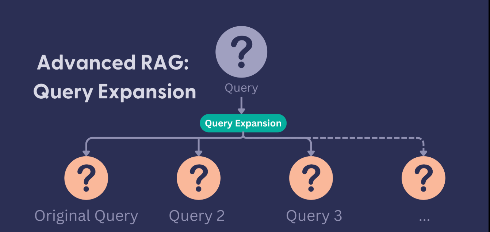

# Query Expansion in Retrieval-Augmented Generation (RAG)

**Query Expansion** is a technique used to improve the retrieval of relevant information by broadening or refining the user's original query. 

In standard RAG, if a user asks a question using specific terms that don't perfectly match the document index (the **"vocabulary mismatch"** problem), the system might fail to find the right information. Query expansion bridges this gap by generating multiple versions of the query or adding context to it.


---

## 1. Why Use Query Expansion?

* **Improves Recall:** It captures documents that use synonyms or related concepts instead of the exact words in the user's query.
* **Disambiguation:** It clarifies vague questions (e.g., "Tell me about the Apple results" becomes queries about "Apple Inc. Q4 earnings" and "Apple fruit harvests").
* **Context Enrichment:** It adds necessary background information that might be missing from a short user prompt.

---

## 2. Key Query Expansion Techniques

### **A. Multi-Query Retrieval**
The system uses an LLM to generate several variations of the user's original question from different perspectives.

* **How it works:** If you ask *"How does photosynthesis work?"*, the LLM might generate:
    * "Explain the biological process of light conversion in plants."
    * "What are the stages of the Calvin cycle?"
    * "Chemical equation for plant glucose production."
* **Result:** The system performs a search for **all** these queries and merges the results, ensuring a much wider net is cast.

### **B. HyDE (Hypothetical Document Embeddings)**
Instead of searching for the query itself, the system asks an LLM to generate a "fake" or hypothetical answer first.

* **How it works:** The system takes your question, generates a plausible-sounding (but potentially factually incorrect) paragraph answering it, and then uses that paragraph to search the vector database.
* **Why it works:** Dense vector models are often better at matching "document-to-document" than "query-to-document." By searching with a hypothetical answer, you are looking for real documents that "look like" the answer.

### **C. Query Decomposition (Sub-Querying)**
For complex, multi-part questions, the system breaks the query into smaller, manageable sub-questions.

* **Example:** *"Compare the 2023 revenue of Microsoft and Google."*
* **Expansion:**
    1.  "What was Microsoft's total revenue in 2023?"
    2.  "What was Google's total revenue in 2023?"
* **Benefit:** This is essential for "multi-hop" reasoning where the answer isn't in a single document.

### **D. Step-Back Prompting**
This technique involves generating a more generic, high-level "step-back" question to retrieve foundational context.

* **Example:** If the query is *"Why did my specific NVIDIA H100 GPU fail during this CUDA kernel execution?"*, the step-back query might be *"What are the common causes of CUDA kernel failures on Hopper architecture?"*

---

## 3. Comparison of Techniques

| Technique | Best For... | Drawback |
| :--- | :--- | :--- |
| **Multi-Query** | Increasing recall and catching synonyms. | Higher latency (multiple searches). |
| **HyDE** | Vague queries or "zero-shot" domain gaps. | Can "hallucinate" its way into the wrong neighborhood. |
| **Decomposition** | Complex, multi-faceted, or comparison questions. | Requires more sophisticated orchestration logic. |
| **Step-Back** | Questions requiring deep foundational knowledge. | May retrieve information that is too general. |

---

## Summary Flow

1.  **User Input:** The original query.
2.  **Expansion:** An LLM generates variations or sub-queries.
3.  **Retrieval:** Each expanded query pulls documents from the vector store.
4.  **Fusion/Reranking:** The results are combined and filtered for the most relevant "top-k" chunks.
5.  **Generation:** The final LLM generates the answer using this enriched context.

---

# RAG System Architecture Documentation

This document outlines the architectural patterns for Retrieval-Augmented Generation (RAG) systems, ranging from baseline implementations to advanced configurations using Query Expansion.

---

## 1. Baseline RAG Architecture (Naive RAG)

The baseline architecture follows a linear, "one-shot" retrieval process. It is best suited for simple queries where the user's language closely matches the indexed data.

### **Diagram**

  

### **Components**
* **Ingestion Pipeline:**
    * **Loaders:** Extracts raw data from sources (PDFs, APIs, Markdown).
    * **Chunking:** Splits text into fixed-size segments with overlap to preserve context.
    * **Embeddings:** A transformer model (e.g., `text-embedding-3-small`) converts text to vectors.
    * **Vector Database:** Indexing and storage (e.g., Pinecone, Weaviate).
* **Inference Pipeline:**
    * **Retrieval:** Performs a cosine similarity search between the query vector and the database.
    * **Augmentation:** Injects retrieved context into the LLM system prompt.
    * **Generation:** The LLM synthesizes the final answer.

---

## 2. Advanced RAG Architecture (Query Expansion & Reranking)

This architecture addresses the "Vocabulary Mismatch" problem by introducing a transformation layer between the user and the retriever.

### **Diagram**


### **The Expansion & Retrieval Workflow**
1.  **Query Transformation:** The LLM acts as an "optimizer," rewriting the user query into multiple variations (Multi-Query) or a hypothetical answer (HyDE).
2.  **Parallel Retrieval:** Multiple search requests are sent to the vector store simultaneously.
3.  **Reciprocal Rank Fusion (RRF):** An algorithm that combines the results from multiple queries, prioritizing documents that appear frequently across different search variations.
4.  **Cross-Encoder Reranking:** A secondary model (like BGE-Reranker) performs a deep semantic comparison between the original query and the candidate chunks to filter out noise.

---

## 3. Specialized Design Patterns

### **A. Agentic RAG (Query Decomposition)**
Designed for multi-step reasoning or "Multi-Hop" questions.
* **Planner:** An LLM Agent breaks a complex query into a task list.
* **Execution:** The agent retrieves data for sub-task A, reflects on the result, and then retrieves data for sub-task B.
* **Synthesizer:** Combines all findings into a cohesive report.

### **B. HyDE (Hypothetical Document Embeddings)**
Designed to solve the "Short Query vs. Long Document" embedding gap.
* **Process:** Instead of $Query \rightarrow Vector$, it follows $Query \rightarrow LLM \rightarrow Fake Answer \rightarrow Vector$.
* **Advantage:** It aligns the vector search to find "answers" rather than just finding "questions."

---

## 4. Architectural Comparison Table

| Feature | Naive RAG | Multi-Query RAG | Agentic RAG |
| :--- | :--- | :--- | :--- |
| **Logic** | Linear | Parallel | Iterative |
| **Search Count** | 1 per query | $N$ per query | Dynamic |
| **Latency** | Low (< 2s) | Medium (3-5s) | High (> 10s) |
| **Accuracy** | Baseline | High (Better Recall) | Very High (Better Reasoning) |
| **Use Case** | Internal FAQs | General Knowledge Base | Financial/Legal Analysis |

---

## 5. Summary Flow
1. **User Input** $\rightarrow$ 2. **Expansion/Rewrite** $\rightarrow$ 3. **Vector Search** $\rightarrow$ 4. **Reranking** $\rightarrow$ 5. **Generation**

# Sequence and Flow Architecture: Query Expansion in RAG

This document details the step-by-step logic of an advanced RAG pipeline utilizing Query Expansion, Fusion, and Reranking.

---

## 1. High-Level System Flow
The following diagram illustrates how a single user input is expanded into multiple search vectors to ensure the highest possible document recall.


### **Step-by-Step Execution**
1.  **Query Transformation (LLM):** The raw user query is passed to a specialized prompt. The LLM generates $N$ variations (e.g., synonyms, related sub-questions).
2.  **Parallel Embedding:** Each of the $N$ queries is converted into a vector embedding simultaneously.
3.  **Vector Retrieval:** The system performs $N$ separate similarity searches against the Vector Database (e.g., Pinecone, Milvus).
4.  **Result Fusion (RRF):** The system aggregates the top-k results from all $N$ searches. It uses **Reciprocal Rank Fusion** to ensure that documents found by multiple queries are ranked higher.
5.  **Re-Ranking:** A Cross-Encoder model (more computationally expensive but highly accurate) evaluates the final list of candidates against the *original* user query.
6.  **Context Injection:** Only the top-scoring refined chunks are sent to the final Generation LLM.

---

## 2. Sequence Diagram (The "Inference" Loop)
This diagram shows the interaction between the User, the Orchestrator, the LLM, and the Vector Store.


| Entity | Role |
| :--- | :--- |
| **User** | Provides the initial natural language prompt. |
| **Orchestrator** | Coordinates the logic (e.g., LangChain or LlamaIndex). |
| **Expansion LLM** | Rewrites the query into multiple perspectives. |
| **Vector DB** | Returns the nearest neighbor chunks for each vector. |
| **Reranker** | Validates the semantic relevance of the retrieved chunks. |
| **Generator LLM** | Produces the final natural language answer. |

---

## 3. Implementation Logic (Pseudo-Architecture)

To build this architecture, the orchestrator must follow this logical flow:

```python
# Conceptual Logic
original_query = "How do I optimize a CUDA kernel?"

# 1. Expand
expanded_queries = llm.generate_variations(original_query, n=3) 
# Results: ["CUDA optimization techniques", "Memory coalescing in CUDA", "GPU kernel performance"]

# 2. Retrieve (Parallel)
all_docs = []
for q in expanded_queries:
    docs = vector_db.search(q)
    all_docs.extend(docs)

# 3. Refine
fused_docs = rrf_algorithm(all_docs)
final_context = reranker.score(original_query, fused_docs)[:3]

# 4. Generate
answer = llm.generate_answer(original_query, final_context)

```


### 4. Key Architectural Trade-offs
Latency: Query expansion increases the time-to-first-token because it requires an extra LLM call and multiple vector searches.

Cost: Running multiple queries increases token usage and database read units.

Accuracy: This architecture significantly reduces "hallucinations" caused by poor context retrieval.
