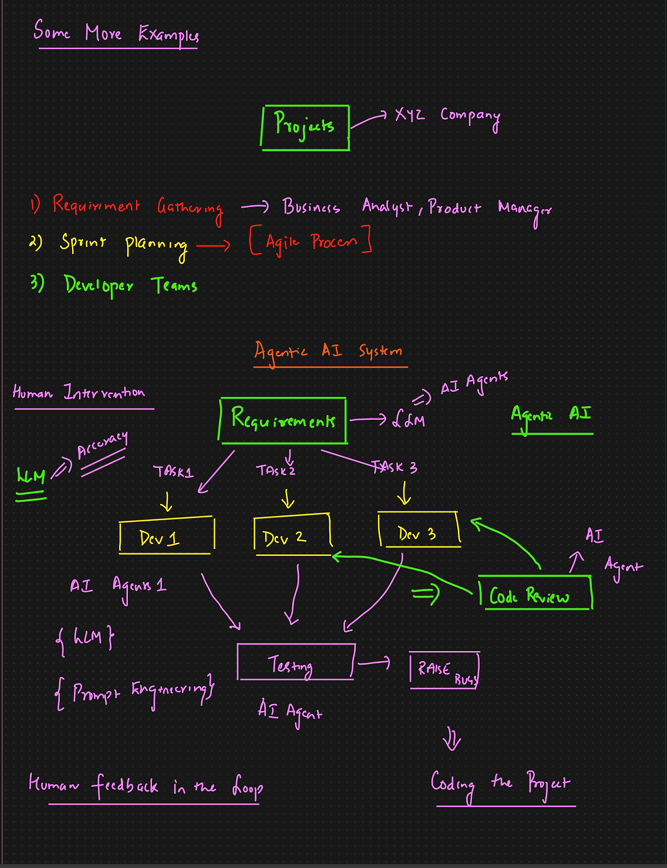

# Agentic AI – Project Workflow & Examples (Decoded Notes)

This document decodes the handwritten notes from the provided image and converts them into detailed, structured Markdown documentation. The focus is on how **Agentic AI** can be applied to real-world **project execution workflows**.

---

## 1. Context: Projects in an Organization

The image starts with a generic **Project** in an organization (e.g., *XYZ Company*).

Traditional software projects typically involve:

1. **Requirement Gathering**

   * Business Analyst (BA)
   * Product Manager (PM)

2. **Sprint Planning**

   * Part of the **Agile process**
   * Breaking requirements into tasks

3. **Developer Teams**

   * Multiple developers working on assigned tasks

This process normally requires **significant human intervention**.

---

## 2. Shift Toward an Agentic AI System

The image then introduces an **Agentic AI System** as an alternative or augmentation to the traditional workflow.

Instead of humans manually coordinating everything, **Agentic AI takes ownership of the workflow**, while humans provide oversight and feedback.

---

## 3. Agentic AI System – High-Level Flow

### Central Requirement Hub

```
Requirements
   ↓
   LLM
   ↓
AI Agents
```

* Requirements are provided as input
* An **LLM** interprets the requirements
* Tasks are dynamically generated and assigned to AI agents

---

## 4. Task Decomposition and Assignment

The requirements are broken down into multiple tasks:

* Task 1 → Dev 1
* Task 2 → Dev 2
* Task 3 → Dev 3

In an Agentic AI system:

* “Dev 1 / Dev 2 / Dev 3” can represent:

  * AI coding agents
  * Specialized development agents

```
Requirement
 ├── Task 1 → Agent / Dev 1
 ├── Task 2 → Agent / Dev 2
 └── Task 3 → Agent / Dev 3
```

---

## 5. Role of AI Agents

### AI Agents Capabilities

Each AI agent:

* Is powered by an **LLM**
* Uses **prompt engineering**
* Works on a well-defined task

These agents function like **virtual developers**.

---

## 6. Code Review as an Agentic Step

The image highlights **Code Review** as a key automated step.

* Code produced by agents is sent to a **Code Review AI Agent**
* The reviewer agent:

  * Validates logic
  * Checks standards
  * Suggests improvements

```
Dev Agents → Code Review Agent
```

This step reduces manual review effort.

---

## 7. Testing and Quality Gates

After development:

* Code flows into a **Testing AI Agent**
* Automated tests are executed
* Failures are identified early

```
Code → Testing Agent → Pass / Fail
```

---

## 8. Raise Bugs & Feedback Loop

If issues are detected:

* Bugs are automatically raised
* Feedback is sent back to the appropriate AI agent

```
Testing → Raise Bug → Agent Fix → Retest
```

This creates a **continuous improvement loop**.

---

## 9. Human Feedback in the Loop

Although Agentic AI drives execution, **humans remain in control**.

Human involvement includes:

* Accuracy validation
* Business alignment checks
* Final approvals

```
AI System ⇄ Human Feedback
```

This ensures trust and governance.

---

## 10. End-to-End Agentic AI Workflow

```
Requirements
   ↓
LLM (Planner)
   ↓
Task Decomposition
   ↓
AI Dev Agents
   ↓
Code Review Agent
   ↓
Testing Agent
   ↓
Bug Raising
   ↓
Fixes & Iteration
   ↓
Coding the Project
```

---

## 11. Key Differences from Traditional Workflow

| Traditional Project      | Agentic AI Project        |
| ------------------------ | ------------------------- |
| Heavy human coordination | Autonomous coordination   |
| Manual task assignment   | Dynamic task planning     |
| Human code reviews       | AI-driven code review     |
| Manual testing           | Automated testing agents  |
| Slow feedback cycles     | Continuous feedback loops |

---

## 12. Why This is Agentic AI

This workflow qualifies as **Agentic AI** because:

* The system owns the **goal** (deliver working code)
* Tasks are planned and reassigned dynamically
* Multiple agents collaborate
* Feedback loops exist
* Humans supervise rather than micromanage

---

## 13. Final Takeaway

> **Agentic AI transforms project execution from human-driven coordination to goal-driven autonomous systems, with humans guiding quality and direction.**

---

*End of decoded documentation*
