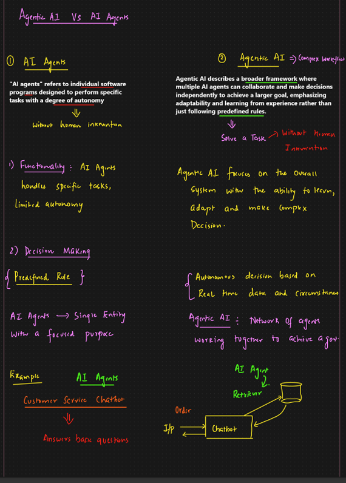
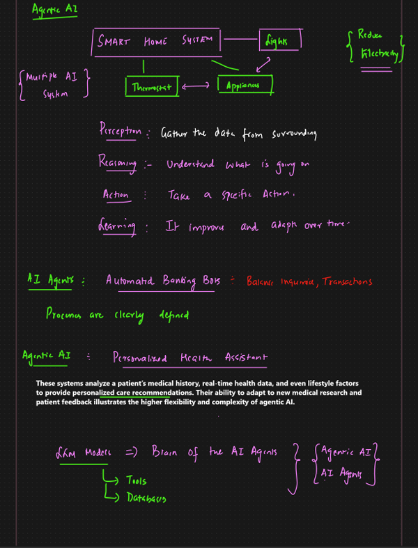

# AI Agent vs Agentic AI

Complete, structured notes for understanding the difference between **AI Agents** and **Agentic AI**, with definitions, architecture, examples, and practical guidance.

---

## 1. What is an AI Agent?

An **AI Agent** is a **single, task-oriented system** that receives an input, optionally uses tools, and produces an output. It operates within a **narrow scope** and usually follows predefined instructions or prompts.

### Key Characteristics

* 🎯 Task-focused (one task at a time)
* 📜 Prompt-driven or rule-based
* 🧠 Minimal or no long-term planning
* 🛠️ Tool usage is explicit and limited
* 🔁 No self-reflection or learning loop

### Mental Model

> “Tell me what to do, and I will do it.”

### Typical Workflow

```
User Input → LLM → Tool (optional) → Response
```

### Examples

* SQL query generator
* Chatbot answering FAQs
* Email drafting assistant
* Data extraction script using LLM

### Technologies Commonly Used

* LLM (GPT, Claude, etc.)
* Prompt templates
* Tool calling / function calling
* Simple retrieval (optional)

---

## 2. What is Agentic AI?

**Agentic AI** refers to a **goal-driven AI system** that can plan, reason, decide next steps, use multiple tools or agents, and adapt based on outcomes. It is not just an agent, but an **agent-based system**.

### Key Characteristics

* 🧭 Goal-oriented rather than task-oriented
* 🧠 Multi-step reasoning and planning
* 🔄 Self-reflection and error correction
* 🧩 Problem decomposition
* 🤝 Often multi-agent
* 🧠 Uses memory (short-term and long-term)

### Mental Model

> “Here is the goal. I will figure out how to achieve it.”

### Typical Workflow

```
Goal
 ↓
Planner Agent
 ↓
Executor Agents (Search, SQL, Validation, etc.)
 ↓
Reflection / Critic Agent
 ↓
Final Answer + Learning
```

### Examples

* Report issue analyzer
* Autonomous QA system
* Dev productivity copilot
* AI researcher agent
* Automated reconciliation system

### Technologies Commonly Used

* Planner–Executor pattern
* Multi-agent frameworks (LangGraph, AutoGen, CrewAI)
* RAG (Retrieval-Augmented Generation)
* Vector databases
* Memory stores
* Feedback loops

---

## 3. Core Differences (Comparison Table)

| Dimension       | AI Agent     | Agentic AI                   |
| --------------- | ------------ | ---------------------------- |
| Scope           | Single task  | End-to-end goal              |
| Autonomy        | Low          | High                         |
| Planning        | Minimal      | Explicit multi-step planning |
| Decision making | Prompt-based | Reasoning-based              |
| Tool usage      | Explicit     | Dynamic                      |
| Error handling  | Manual       | Self-correcting              |
| Memory          | Optional     | Core component               |
| Multi-agent     | Rare         | Common                       |
| Complexity      | Low–Medium   | Medium–High                  |

---

## 4. Architecture Comparison

### AI Agent Architecture

```
User → LLM → Tool → Output
```

* Linear execution
* No feedback loop
* No state persistence

### Agentic AI Architecture

```
Goal
 ↓
Planner
 ↓
[Retriever | SQL Agent | Validator | Analyzer]
 ↓
Reflection / Critic
 ↓
Answer + Memory Update
```

* Non-linear execution
* Feedback loops
* Persistent memory

---

## 5. One-Line Definitions (Interview Ready)

* **AI Agent**: Executes a specific task using predefined logic and tools.
* **Agentic AI**: Pursues a goal by planning, reasoning, acting, and adapting autonomously.

Or simply:

> **AI Agent = “Do this.”**
> **Agentic AI = “Achieve this.”**

---

## 6. When to Use AI Agent

Use an **AI Agent** when:

* The task is well-defined
* Steps are stable and repeatable
* Low ambiguity
* Predictability is important

### Examples

* Generate SQL
* Convert text to JSON
* Summarize a document
* Answer a known FAQ

---

## 7. When to Use Agentic AI

Use **Agentic AI** when:

* The problem is ambiguous
* Root-cause analysis is required
* Multiple tools or data sources are involved
* The system must decide next actions

### Examples

* Financial report reconciliation
* Issue root-cause analysis
* Automated testing and validation
* AI-powered data analyst

---

## 8. Relationship Between the Two

Important clarification:

> **Agentic AI is not a replacement for AI Agents.**

Instead:

* AI Agents are **building blocks**
* Agentic AI is the **orchestrated system**

```
Agentic AI System
 ├── Retrieval Agent
 ├── SQL Agent
 ├── Validation Agent
 ├── Explanation Agent
```

---

## 9. Common Misconceptions

❌ “Any chatbot with tools is agentic”
✅ Tool usage alone does not make a system agentic

❌ “Agentic AI means fully autonomous and dangerous”
✅ Most agentic systems are constrained and goal-bounded

❌ “Agentic AI is just prompt chaining”
✅ It includes planning, memory, feedback, and control flow

---

## 10. Practical Mapping to Real Projects

### Simple RAG Chatbot

* Category: **AI Agent**
* Behavior: Retrieves documents and answers

### Report Issue Analyzer

* Category: **Agentic AI**
* Behavior:

  * Understands question
  * Chooses validation steps
  * Executes SQL
  * Compares results
  * Explains root cause

---

## 11. Evolution Path

```
LLM
 → AI Agent
 → Tool-Using Agent
 → Multi-Agent System
 → Agentic AI
```

---

## 12. Final Takeaway

* **AI Agents** are excellent for **execution**
* **Agentic AI** is designed for **reasoning and ownership of outcomes**

If the question is *“What should I do next?”*, you are in **Agentic AI territory**.

---

*End of notes*



# Agentic AI vs AI Agents (Decoded from Image)

This document decodes and formalizes the handwritten notes from the provided image into clean, structured Markdown for study, interviews, and documentation.

---

## 1. AI Agents

### Definition

> **AI Agents** refer to individual software programs designed to perform specific tasks with a degree of autonomy.

They operate **without human intervention** once initiated, but their autonomy is **limited to predefined behavior**.

---

### Core Characteristics

* Designed for **specific tasks**
* **Limited autonomy**
* Narrow functional scope
* Operates independently after being triggered
* Does not reason about broader system goals

---

### Functionality

* Handles **one task at a time**
* Executes actions based on **explicit instructions**
* No understanding of the larger context

---

### Decision Making

* Driven by **predefined rules**
* Logic is static or prompt-based
* No learning from experience

```
If condition → Perform action
```

---

### Structural View

* **Single entity**
* Focused purpose

```
AI Agent = One role → One outcome
```

---

### Example

**Customer Service Chatbot**

* Answers basic customer questions
* Follows predefined conversational flows
* Does not analyze or optimize business processes

---

### Simplified Flow

```
User → Chatbot → Retriever → Response
```

---

## 2. Agentic AI

### Definition

> **Agentic AI** describes a broader framework where multiple AI agents collaborate and make decisions independently to achieve a larger goal.

It emphasizes **adaptability, learning, and autonomy**, rather than strict rule-following.

---

### Core Characteristics

* Designed for **complex workflows**
* Operates without continuous human intervention
* Focuses on **overall system goals**
* Learns and adapts from experience

---

### System Focus

Agentic AI is concerned with:

* Learning from outcomes
* Adapting to new situations
* Making **complex decisions**
* Handling uncertainty and changing inputs

---

### Decision Making

* **Autonomous decisions**
* Based on:

  * Real-time data
  * Context
  * Environmental conditions
* Not restricted to predefined rules

---

### Structural View

* **Network of agents**
* Each agent has a role
* Agents collaborate to reach a shared goal

```
Agentic AI = Multiple agents → One goal
```

---

### Conceptual Flow

```
Goal
 ↓
Multiple AI Agents
 ↓
Collaboration + Autonomous Decisions
 ↓
Goal Achieved
```

---

## 3. Key Differences Highlighted

| Aspect          | AI Agents        | Agentic AI             |
| --------------- | ---------------- | ---------------------- |
| Scope           | Single task      | Complex workflows      |
| Autonomy        | Limited          | High                   |
| Rule dependency | Predefined rules | Adaptive behavior      |
| Learning        | Minimal or none  | Learns from experience |
| Structure       | Single agent     | Network of agents      |
| Focus           | Task execution   | Goal achievement       |

---

## 4. One-Line Summary

* **AI Agent**: A single-purpose intelligent worker
* **Agentic AI**: A coordinated system of intelligent workers achieving a larger goal

---

## 5. Practical Mapping

* Simple chatbot or RAG QA system → **AI Agent**
* Report issue analyzer, reconciliation engine, DevPilot-style system → **Agentic AI**

---

## 6. Final Takeaway

> **AI Agents are the building blocks.**
> **Agentic AI is the intelligent architecture that connects them to solve complex problems.**

---

*End of decoded notes*




# Agentic AI – Decoded Notes and Examples (From Image)

This document decodes the handwritten diagram and notes from the provided image and converts them into structured, easy-to-read Markdown documentation.

---

## 1. Agentic AI – Smart Home System Example

### High-Level Overview

The image illustrates **Agentic AI** using a **Smart Home System** as an example, where **multiple AI agents** work together to achieve a shared goal: optimizing comfort, safety, and energy efficiency.

```
Smart Home System
 ├── Thermostat
 ├── Lights
 └── Appliances

Goal: Reduce electricity usage while maintaining comfort
```

Each component behaves like an **AI agent**, but intelligence emerges from their **coordination**.

---

## 2. Multi-Agent System Concept

* The smart home is shown as a **multiple AI system**
* Individual agents communicate and coordinate
* Decisions are not isolated; they influence one another

Examples of coordination:

* Thermostat adjusts temperature
* Lights turn off when rooms are empty
* Appliances optimize usage timing

---

## 3. Core Capabilities of Agentic AI

The image highlights four foundational capabilities:

### 1. Perception

> **Gather data from the surroundings**

Examples:

* Room temperature
* Light levels
* Appliance usage
* Occupancy

---

### 2. Reasoning

> **Understand what is going on**

Examples:

* Interpreting whether rooms are occupied
* Determining peak vs off-peak electricity hours
* Detecting abnormal patterns

---

### 3. Action

> **Take a specific action**

Examples:

* Adjust thermostat
* Turn lights on or off
* Delay appliance usage

---

### 4. Learning

> **Improve and adapt over time**

Examples:

* Learn user preferences
* Optimize schedules
* Adapt to seasonal changes

---

## 4. AI Agent Example (Task-Oriented)

### Automated Banking Bot

**Category:** AI Agent

**Responsibilities:**

* Balance inquiries
* Transaction lookups

**Characteristics:**

* Processes are **clearly defined**
* Limited decision-making
* No system-wide goal optimization

```
User → Banking Bot → Database → Response
```

---

## 5. Agentic AI Example (Goal-Oriented)

### Personalized Health Assistant

**Category:** Agentic AI

**Capabilities:**

* Analyzes patient medical history
* Consumes real-time health data
* Considers lifestyle factors
* Adapts recommendations over time

**Why this is Agentic AI:**

* Learns from new data
* Adjusts recommendations dynamically
* Handles complexity and uncertainty

---

## 6. Complexity Comparison Insight

> The image emphasizes that **Agentic AI systems have higher flexibility and complexity** compared to simple AI agents.

* AI Agents → Predictable, rule-based
* Agentic AI → Adaptive, evolving

---

## 7. Role of LLMs in Agentic AI

### LLMs as the Brain

The image notes:

> **LLM Models = Brain of AI Agents**

### What LLMs Connect To

* Tools
* Databases

```
LLM
 ├── Tools
 └── Databases
```

LLMs enable:

* Reasoning
* Planning
* Natural language understanding

They can power:

* Individual AI Agents
* Entire Agentic AI systems

---

## 8. Relationship Summary

```
AI Agents  → Building blocks
Agentic AI → Orchestrated system of agents
LLM       → Cognitive engine (brain)
```

---

## 9. Key Takeaways

* Agentic AI is built from **multiple AI agents**
* Intelligence comes from **coordination and learning**
* Perception, reasoning, action, and learning are core loops
* LLMs act as the **decision-making brain**
* Agentic AI systems scale to complex, real-world problems

---

*End of decoded documentation*


