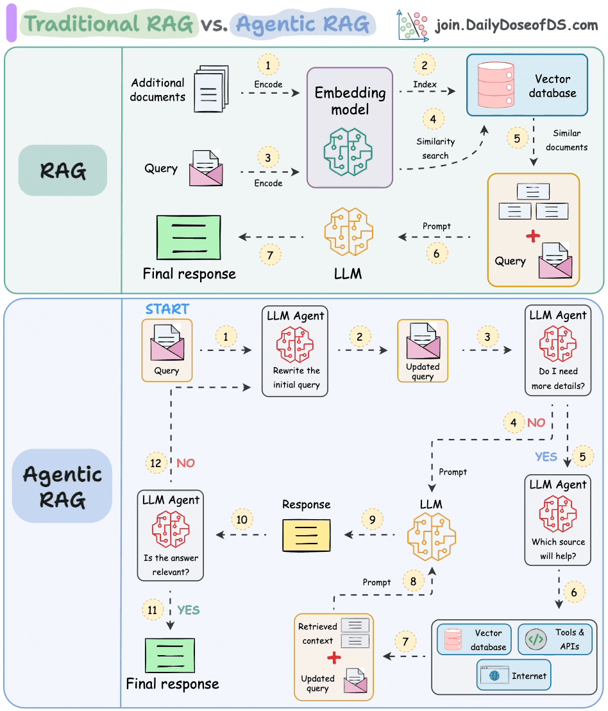

# 🧠 Agentic RAG, explained like a thinking machine that knows how to use tools

**Agentic RAG** is Retrieval-Augmented Generation with decision-making ability.

Classic RAG is like a very smart librarian who always follows the same routine.  
Agentic RAG is like a detective who decides what to do next based on what they discover.

Let’s unfold it layer by layer.

---

## 1️⃣ First, a quick recap: What is RAG?

### Standard RAG pipeline

User Query  
↓   
Retrieve documents (vector search)   
↓   
Stuff docs into prompt  
↓  
LLM generates answer  


### Strengths

- Grounds answers in documents  
- Reduces hallucination  

### Limitations

- Single-shot retrieval  
- No planning  
- No tool usage beyond retrieval  
- No self-correction  

If retrieval is weak, the answer collapses like a house on sand.

---

## 2️⃣ What does “Agentic” add to RAG?

**Agentic RAG = RAG + Agent behavior**

An agent can:

- Think step by step  
- Decide which tool to use  
- Loop until the task is solved  
- Adapt its strategy mid-flight  

### Key difference

| Aspect          | Standard RAG     | Agentic RAG              |
|-----------------|------------------|--------------------------|
| Retrieval       | One time         | Multiple, adaptive       |
| Reasoning       | Implicit         | Explicit planning        |
| Tools           | Retriever only   | Retriever, DB, APIs, code|
| Control flow    | Fixed            | Dynamic                  |
| Error handling  | None             | Retry, reformulate       |
| Memory          | Stateless        | Stateful (thread memory) |

---




---

## 3️⃣ Core building blocks of Agentic RAG

### 🧩 1. Planner (Reasoner)

Decides what steps are needed.

**Example internal plan:**

1. Identify report name  
2. Retrieve mapping logic  
3. Check known issues  
4. Decide if DB validation is needed  

---

### 🧩 2. Tools

Reusable actions the agent can invoke.

**Common tools:**

- 🔍 Vector retriever  
- 🗄️ SQL executor  
- 📄 Document loader  
- 🧮 Python / calculation tool  
- 🌐 API calls  

---

### 🧩 3. Memory

Keeps track of:

- Previous queries  
- Retrieved docs  
- Intermediate conclusions  

This allows multi-turn reasoning.

---

### 🧩 4. Controller (Loop)

The agent runs in a loop:

Think → Act → Observe → Think again


Until:

- The answer is good enough  
- Or a stopping condition is met  

---

## 4️⃣ Agentic RAG flow (step by step)

User Question  
↓   
Agent thinks: “What do I need to answer this?”   
↓   
Agent calls Retriever   
↓  
Agent evaluates result      
↓   
Agent decides next action:  
→ retrieve again?   
→ query database?   
→ explain?   
↓  
Agent synthesizes final answer  


This is not linear, it’s adaptive.

---

## 5️⃣ Real-world example (report issue analysis)

### 📌 Problem

> “Why is the AMS 8.3 customer balance mismatching?”

### 🔹 Standard RAG response

- Retrieves generic balance mismatch docs  
- Gives a vague answer:  

> “Balance mismatch can occur due to joins, FX, or timing.”

Not satisfying.

---

### 🔹 Agentic RAG response (what actually happens)

#### 🧠 Step 1: Agent planning

This is a report issue.  
I need:
- Report-specific logic  
- Known issues  
- Possibly DB validation  

---

#### 🔍 Step 2: Targeted retrieval

Agent queries vector store with:

"AMS 8.3 customer balance mismatch known issues"


Finds:

- Join condition issue on contract table  
- Late postings excluded by cutoff filter  

---

#### 🧠 Step 3: Decide next action

Docs suggest join issue.  
Should verify with actual data.

---

#### 🗄️ Step 4: SQL tool execution

Agent generates and runs:

```sql
SELECT COUNT(*)
FROM contracts c
LEFT JOIN postings p
  ON c.contract_id = p.contract_id
WHERE p.contract_id IS NULL;
``` 

Finds missing rows.

## 🧠 Step 5: Synthesis

Agent composes a grounded, confident answer:

> “The AMS 8.3 customer balance mismatch is caused by a LEFT JOIN exclusion where postings without matching contracts are dropped. This impacts customers with late postings after cutoff. The issue is data-driven and reproducible.”

That is Agentic RAG in action 🧠⚙️

---

## 6️⃣ Another example: Verification-style Agentic RAG

### Question

> “Verify if the Total Exposure value in the report is correct.”

### Agent plan

1. Identify column definition  
2. Retrieve calculation logic  
3. Generate SQL  
4. Execute SQL  
5. Compare with report value  
6. Return PASS / FAIL  

### Output

Status: FAIL 
Expected (DB): 12,450,000 
Report Value: 12,300,000 
Difference: -150,000 
Reason: FX rate rounding applied before aggregation 


## 7️⃣ Why Agentic RAG is powerful

### 🚀 What it enables

- Root-cause analysis  
- Data validation  
- Report QA automation  
- Multi-step troubleshooting  
- Interactive assistants for engineers  

### 🧱 What it avoids

- Shallow answers  
- Over-reliance on one retrieval  
- Hallucinated confidence  

---

## 8️⃣ When to use Agentic RAG (and when not to)

### ✅ Use Agentic RAG when:

- Questions require reasoning + data  
- Multiple sources must be combined  
- You need verification or decisions  
- Tasks are procedural  

### ❌ Avoid it when:

- Simple Q&A is enough  
- Latency must be minimal  
- Cost needs to be ultra-low  

---

## 9️⃣ Mental model to remember 🧩

**RAG** = “Answer using documents”  
**Agentic RAG** = “Figure out how to answer, then answer”

One retrieves.  
The other thinks, decides, acts, and then explains.

---

> If you want, I can also:
> - Split this into **README-style sections**
> - Add **architecture diagrams (ASCII or Mermaid)**
> - Turn it into a **blog post** or **slide deck**
>
> Just say the word 🧠✨


