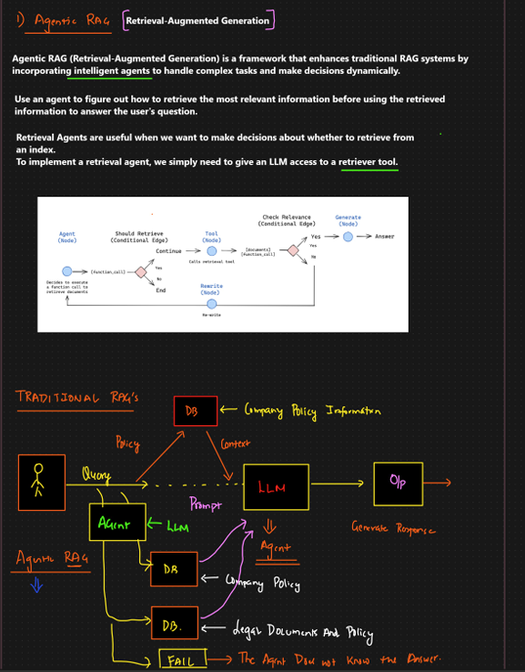

# Agentic RAG (Retrieval-Augmented Generation) — Decoding the Diagram

This document decodes the provided image and explains **Agentic RAG** in detail, including how it differs from **Traditional RAG**, what the **retrieval agent loop** is doing, and how to implement the pattern in practice.

---

## 1) What the image is saying (top section)

### Definition shown
**Agentic RAG (Retrieval-Augmented Generation)** enhances traditional RAG by adding **an intelligent agent** that can:
- decide **whether** retrieval is needed,
- decide **where** to retrieve from (which index / database / policy store),
- decide **what to do next** if retrieval results are weak (rewrite query, retrieve again, or stop),
- finally, generate an answer using the best available evidence.

In short:

> Traditional RAG = retrieve once → generate once  
> Agentic RAG = **decide + retrieve (maybe multiple times) + verify relevance + then generate**

### Key line in the image
To implement a retrieval agent, you give the LLM access to a **retriever tool**.  
That tool can be:
- a vector search retriever (Chroma/FAISS/Pinecone/etc.),
- a keyword search (BM25),
- a database query tool (SQL),
- a “policy” or “rules” knowledge base lookup.

---

## 2) The small flow diagram (middle) — the Retrieval Agent loop

The middle diagram shows a **decision-and-loop** workflow.

### Nodes / steps in the diagram
1. **Agent (Node)**
   - The LLM agent receives the user question.
   - It decides the next action.

2. **Should Retrieve? (Conditional Edge)**
   - Decision point: *Do I need external knowledge?*
   - If **No** → end (or answer directly, depending on your design).
   - If **Yes** → call retrieval tool.

3. **Tool (Node)**
   - The agent calls a **retriever tool** (vector search, DB lookup, etc.).
   - Output: a set of documents/snippets.

4. **Check Relevance (Conditional Edge)**
   - Decision point: *Are retrieved results relevant enough?*
   - If **Yes** → proceed to generation.
   - If **No** → rewrite the query and try again.

5. **Rewrite (Node)**
   - The agent reformulates the query (adds keywords, clarifies entities, uses synonyms).
   - Then the workflow loops back to retrieval.

6. **Generate (Node)**
   - The final response is generated using relevant retrieved context.

### What this loop accomplishes
This loop fixes the classic RAG failure mode:
- user asks something specific,
- retriever returns broad or wrong chunks,
- LLM answers vaguely.

Agentic RAG instead:
- *detects* weak retrieval,
- *improves* the query,
- retries,
- and only generates when evidence is strong.

---

## 3) Bottom diagram — Traditional RAG vs Agentic RAG

The bottom half has a hand-drawn comparison.

### A) Traditional RAG (as drawn)
**Flow:**
1. **User** sends a **Query**
2. Query goes to **DB / Index** (shown as “DB”)
3. DB returns **Context**
4. Context is placed into a **Prompt**
5. Prompt goes to **LLM**
6. LLM produces **O/P (Output)** → “Generative Response”

**Important labels in the image:**
- “Policy” is shown as something retrieved from the DB.
- “Context” is fed into the LLM.
- The LLM is the generator, but it doesn’t control retrieval strategy.

**Limitation:** retrieval is usually *single-shot* and not self-correcting.

---

### B) Agentic RAG (as drawn)
Here the **Agent** is inserted as a controller.

**Flow:**
1. **User → Agent**
2. Agent may consult multiple sources:
   - **DB** containing *company policy information*
   - **DB** containing *documents and policy*
   - Possibly other stores (tickets, runbooks, wiki, schemas)

3. Agent then passes the right context to the **LLM** (or the agent itself is the LLM orchestrator).

4. The diagram also shows an explicit **FAIL** box:
   - If the agent cannot find evidence or doesn’t know,
   - it should respond honestly: **“I don’t know the answer”** (instead of hallucinating).

### Why the “FAIL / I don’t know” box matters
Agentic RAG often includes **guardrails**:
- If retrieval confidence is low,
- or the answer is not supported by sources,
- the agent returns a safe fallback (ask for more details, or say it can’t confirm).

This is critical for enterprise/reporting systems.

---

## 4) What “Agentic” really means here

Agentic RAG adds **control flow** to RAG:

- **Planning:** decide steps (retrieve? from where?)
- **Tool use:** call retrievers / DB / APIs
- **Evaluation:** check relevance / confidence
- **Iteration:** rewrite + retry
- **Stop condition:** generate or fail safely

This is commonly implemented using patterns like:
- **ReAct** (Reason + Act + Observe loop)
- **LangGraph** graphs (nodes + conditional edges)
- function/tool calling agents

---

## 5) Concrete example aligned with the diagram

### Example question
> “Why am I getting ORA-00942 in AMS 8.3 report?”

### Agentic RAG behavior
1. **Should Retrieve?**  
   Yes (needs report-specific knowledge + Oracle meaning).

2. **Retrieve (tool call):**
   - search: “ORA-00942 AMS 8.3 report known issues mapping table”
   - returns docs:
     - ORA-00942 definition (table/view missing or privilege)
     - AMS 8.3 mapping mentions missing synonym/grants for a staging table

3. **Check relevance:**
   - if retrieved docs are generic only, agent triggers **Rewrite**

4. **Rewrite query:**
   - adds specifics: “schema grants synonyms staging table AMS 8.3 ORA-00942”
   - retrieve again

5. **Generate answer:**
   - provides probable root causes + verification SQL:
     - check table existence
     - check grants
     - check synonyms
     - confirm schema in report connection

6. **If no evidence exists:**
   - return **FAIL** style response:
     - “I can’t confirm from available docs. Please share the schema/table name or the failing query.”

---

## 6) Minimal implementation blueprint (LangGraph-style)

Below is a conceptual blueprint matching the middle diagram.

### Components
- **retriever_tool(query) → docs**
- **relevance_checker(query, docs) → yes/no**
- **query_rewriter(query) → better_query**
- **generator(query, docs) → final_answer**

### Pseudocode
```python
query = user_question

# 1) decide retrieve
if not should_retrieve(query):
    return generate_without_retrieval(query)

# 2) retrieval loop
for attempt in range(MAX_TRIES):
    docs = retriever_tool(query)

    if is_relevant(query, docs):
        return generate_answer(query, docs)

    query = rewrite_query(query, docs)

# 3) safe fallback (FAIL)
return "I couldn't find reliable supporting information for this. Please provide more details."
```

This exactly mirrors:
**Agent → Should Retrieve? → Tool → Check Relevance? → (Rewrite loop) → Generate → Answer**

---

## 7) Practical tips to make Agentic RAG work well

### Relevance checking
Use at least one of:
- similarity score threshold,
- LLM-based grading prompt (“Are these docs sufficient to answer?”),
- keyword/entity overlap checks.

### Rewrite strategies
- add missing entities (report name, module, schema, table)
- expand acronyms (AMS, OLFM)
- include likely synonyms (“privilege”, “grant”, “synonym” for ORA errors)

### Multi-source routing
Often you’ll route retrieval by intent:
- “policy” questions → policy DB
- “how-to” → runbooks
- “report logic” → mapping docs
- “data validation” → SQL tool

### Fail safely
If the agent cannot support the answer from sources:
- say you can’t confirm,
- ask one targeted follow-up,
- or provide a checklist rather than an asserted root cause.

---

## 8) Summary in one paragraph

The image describes **Agentic RAG** as a smarter version of RAG where an **agent controls retrieval**. Instead of retrieving once and generating, the agent decides whether retrieval is needed, calls a retriever tool, checks relevance, rewrites queries when results are weak, and only then generates an answer. Compared to traditional RAG, Agentic RAG is dynamic, iterative, and safer because it can explicitly fail when it cannot find evidence.

